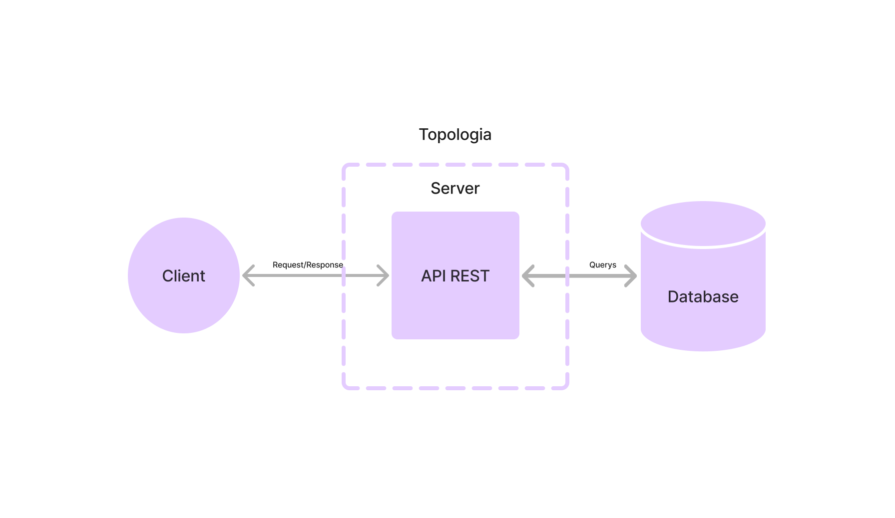
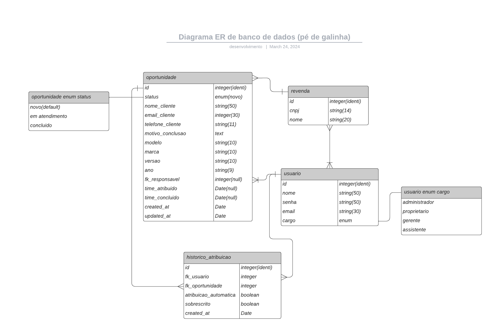

# Documentação Técnica

> [Voltar ao README](../README.md)

## Topologia

A topologia da aplicação é composta por um servidor de aplicação e um servidor de banco de dados. A aplicação possui apenas um serviço(monolito). O backend é responsável por toda a lógica de negócio e comunicação com o banco de dados.
Utilizando do protocolo HTTP e padrão Restful.

## Diagrama Banco de Dados (Propostas Inicial)

O banco de dados foi modelado com base nos requisitos iniciais do projeto. A modelagem foi feita utilizando o modelo relacional, com o objetivo de garantir a integridade dos dados e a consistência das informações.

## Casos de Uso (Proposta Inicial)

🔹 [Cadastro de Revenda](./casos-de-usos/cadastro-revenda.md)

🔹 [Cadastro de Usuário](./casos-de-usos/cadastro-usuario.md)

🔹 [Edição de Usuário](./casos-de-usos/edicao-usuario.md)

🔹 [Cadastro de Oportunidade](./casos-de-usos/cadastro-oportunidade.md)

🔹 [Edição de Oportunidade](./casos-de-usos/edicao-oportunidade.md)

🔹 [Lista Oportunidade](./casos-de-usos/lista-oportunidade.md)

🔹 [Lista Loja](./casos-de-usos/lista-loja.md)

🔹 [Atribuição de Oportunidade](./casos-de-usos/atribuicao-oportunidade.md)

> [Voltar ao README](../README.md)
